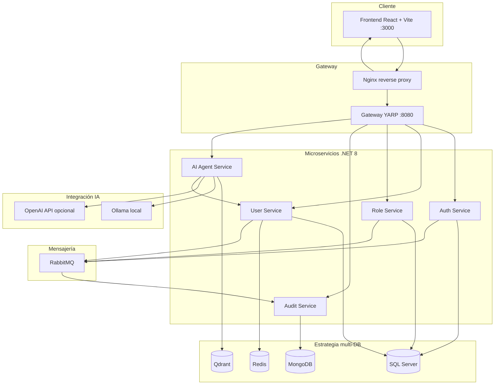

# Toka User Management System

Prueba técnica **Senior Full-Stack Engineer (IA)** — sistema de gestión de usuarios con microservicios (.NET 8), frontend React, agente IA con RAG, auditoría y despliegue Docker.

**Repositorio:** https://github.com/Roberto-rgb-code/Prueba_Tecnica_Desarrollador_Fullstack_ia

---

## Cómo levantar el proyecto

Necesitas **Docker Desktop** instalado, encendido y con internet.

### 1. Clonar

```bash
git clone https://github.com/Roberto-rgb-code/Prueba_Tecnica_Desarrollador_Fullstack_ia.git
cd Prueba_Tecnica_Desarrollador_Fullstack_ia
```

### 2. Levantar

**Windows (PowerShell):**

```powershell
$env:DOCKER_BUILDKIT = "0"
docker compose up -d --build
```

**Linux / macOS:**

```bash
export DOCKER_BUILDKIT=0
docker compose up -d --build
```

> La **primera vez** tarda **15–25 minutos** (descarga SQL Server, MongoDB, etc. y compila los microservicios). **No cierres la terminal** hasta que termine.

Comprobar estado:

```bash
docker compose ps
```

Debes ver varios servicios en **running**, incluido `frontend` y `sqlserver`.

### 3. Usar la aplicación

1. Espera **2–3 minutos** más (arranque de SQL Server).
2. Abre **http://localhost:3000**
3. Clic en **Regístrate** → email + contraseña (mín. 6 caracteres) + nombre.
4. Explora: **Usuarios**, **Roles**, **Auditoría**, **Agente IA**.

En el agente prueba: *¿Qué roles existen en el sistema?*

### Detener

```bash
docker compose down
```

### Requisitos

| Requisito | Mínimo |
|-----------|--------|
| Docker Desktop | En ejecución |
| RAM | 10 GB recomendado |
| Disco | 15 GB libres (primera vez) |
| Puerto 3000 | Libre |

### Si algo falla

```bash
docker info
docker compose logs -f
```

| Problema | Qué hacer |
|----------|-----------|
| `error from registry: denied` | No uses `docker-compose.single.yml`. Usa `docker compose up -d --build` (arriba) |
| `docker` no reconocido | Abre Docker Desktop y espera a "Running" |
| Tarda mucho la 1.ª vez | Normal (15–25 min). No uses `Ctrl+C` |
| `http://localhost:3000` no carga | Espera 5 min y ejecuta `docker compose ps` |
| Puerto 3000 ocupado | En `docker-compose.yml` cambia `"3000:80"` del servicio `frontend` |

### Modo contenedor único (opcional, avanzado)

Solo 2 contenedores, pero compila una imagen muy pesada (~45 min):

```powershell
$env:DOCKER_BUILDKIT = "0"
docker compose -f docker-compose.single.yml up -d --build
```

---

## Diseño y arquitectura de software

### Objetivo del sistema

Plataforma de **gestión de usuarios** con autenticación JWT, autorización por roles, auditoría de eventos y un **agente IA con RAG** que responde consultas sobre el dominio (usuarios, roles, auth, auditoría).

### Diagrama de arquitectura



### Microservicios

| Servicio | Responsabilidad | Persistencia |
|----------|-----------------|--------------|
| **AuthService** | Registro, login, emisión JWT | SQL Server (`TokaAuth`) |
| **UserService** | CRUD usuarios, cache de listados | SQL Server (`TokaUsers`) + **Redis** |
| **RoleService** | CRUD roles, asignación usuario↔rol | SQL Server (`TokaRoles`) |
| **AuditService** | Consumer de eventos → logs | **MongoDB** |
| **AiAgentService** | RAG, embeddings, consultas LLM, métricas | Qdrant o store en memoria |
| **Gateway (YARP)** | Punto único de entrada, routing `/api/*` | — |

### Comunicación entre servicios

| Tipo | Tecnología | Uso |
|------|------------|-----|
| **Síncrona** | REST / HTTP | Frontend → Gateway → microservicios; AiAgent consulta UserService |
| **Asíncrona** | **RabbitMQ** | Eventos `user.created`, `user.updated`, `user.logged_in`, `role.assigned` → AuditService |

### Estrategia multi-DB

| Tecnología | Rol | Justificación |
|------------|-----|---------------|
| **SQL Server** | Auth, Users, Roles | ACID, relaciones, integridad transaccional |
| **MongoDB** | Auditoría | Esquema flexible, append-only, consultas por evento |
| **Redis** | Cache UserService | Reduce latencia en listados (TTL 5 min) |
| **Qdrant** | Vectores RAG | Búsqueda semántica sobre base de conocimiento |
| **Ollama** | LLM + embeddings local | Sin API key; modelos `llama3.2:1b` + `nomic-embed-text` |

### DDD y Clean Architecture

Cada microservicio sigue el mismo patrón de capas:

```
Api → Application → Domain ← Infrastructure
```

| Capa | Contenido |
|------|-----------|
| **Domain** | Entidades, value objects, interfaces de repositorio (sin dependencias externas) |
| **Application** | Casos de uso, DTOs, servicios de aplicación, validaciones |
| **Infrastructure** | EF Core, MongoDB driver, RabbitMQ, Redis, clientes OpenAI/Ollama/Qdrant |
| **Api** | Controllers, middleware, `Program.cs`, configuración DI |

Principios aplicados:

- **Bounded contexts** por servicio (Auth, User, Role, Audit, AI)
- **Inversión de dependencias** — Application define interfaces; Infrastructure las implementa
- **Eventos de dominio** publicados vía RabbitMQ para desacoplar escritura y auditoría

### Flujo de datos — Crear usuario

1. Frontend `POST /api/users` → Nginx → Gateway → **UserService**
2. UserService persiste en SQL Server e invalida cache Redis
3. Publica evento `user.created` en **RabbitMQ**
4. **AuditService** consume el evento y guarda en MongoDB
5. Frontend consulta `GET /api/audit` para ver el registro

### Flujo de datos — Consulta al agente IA (RAG)

1. Frontend `POST /api/agent/query` con la pregunta
2. **AiAgentService** genera embedding (Ollama `nomic-embed-text`)
3. Busca documentos similares en vector store (Qdrant o memoria)
4. Construye prompt con contexto RAG + datos en vivo del UserService
5. LLM (Ollama u OpenAI) genera respuesta; si el modelo local falla, aplica síntesis RAG
6. Devuelve respuesta, fuentes, latencia y tokens

### Decisiones técnicas

| Decisión | Justificación |
|----------|---------------|
| .NET 8 + EF Core | Stack enterprise, tipado fuerte, buen soporte Docker |
| YARP Gateway | Punto único de entrada; simplifica CORS y enrutamiento |
| JWT simétrico | Validación distribuida sin servicio central de tokens |
| RabbitMQ | Desacoplamiento productor/consumidor para auditoría |
| Ollama en Docker | Demo reproducible sin API keys comerciales |
| Contenedor all-in-one | Un comando para evaluadores; misma experiencia en cualquier máquina |
| Serilog JSON | Logs estructurados para diagnóstico (ejercicio 4) |

### Modos de despliegue

| Modo | Archivo | Descripción |
|------|---------|-------------|
| **Multi-contenedor** (recomendado) | `docker-compose.yml` | Imágenes públicas + build de microservicios |
| **Contenedor único** (opcional) | `docker-compose.single.yml` | Todo en 1 imagen + Ollama; RAG en memoria |
| **Multi-contenedor** | `docker-compose.yml` | 1 contenedor por servicio + **Qdrant** persistente |

Documentación ampliada: [docs/architecture.md](docs/architecture.md)

---

## Agente IA (Ollama incluido)

El stack descarga automáticamente estos modelos en el primer arranque:

| Modelo | Uso |
|--------|-----|
| `llama3.2:1b` | Chat / respuestas del agente |
| `nomic-embed-text` | Embeddings para RAG (768 dimensiones) |

Prioridad del proveedor LLM:

1. **Ollama** — default en Docker (sin API key)
2. **OpenAi** — si defines `OPENAI_API_KEY` y `LLM_PROVIDER=OpenAi`
3. **Mock** — fallback sin Ollama ni OpenAI

```powershell
$env:OPENAI_API_KEY = "sk-..."
$env:LLM_PROVIDER = "OpenAi"
.\scripts\run-single-container.ps1
```

Cambiar modelo Ollama:

```powershell
$env:OLLAMA_CHAT_MODEL = "phi3:mini"
.\scripts\run-single-container.ps1
```

Documentación de prompts: [docs/prompt-engineering.md](docs/prompt-engineering.md)

---

## Modo multi-contenedor (Qdrant + arquitectura completa)

Para la arquitectura distribuida con **Qdrant** como vector DB persistente:

```powershell
.\scripts\run-docker.ps1
```

| Servicio | URL |
|----------|-----|
| Frontend | http://localhost:3000 |
| API Gateway | http://localhost:5000 |
| RabbitMQ Management | http://localhost:15672 (guest/guest) |
| Qdrant | http://localhost:6333 |

---

## Desarrollo local (sin Docker)

Para depuración con LocalDB:

```powershell
.\scripts\run-local.ps1
```

Requiere SQL Server LocalDB (Visual Studio / Build Tools).

---

## Tests

### Backend (.NET) — 42 tests, coverage ≥ 70%

```powershell
dotnet test TokaUserManagement.sln
.\scripts\run-tests-with-coverage.ps1
```

### Frontend (Vitest)

```powershell
cd frontend
npm install
npm test
```

---

## API principal

Rutas vía gateway en `/api/...`:

| Método | Ruta | Descripción |
|--------|------|-------------|
| POST | `/api/auth/register` | Registro |
| POST | `/api/auth/login` | Login |
| GET | `/api/users` | Listar usuarios |
| POST | `/api/users` | Crear usuario |
| GET | `/api/roles` | Listar roles |
| POST | `/api/roles/{roleId}/assign/{userId}` | Asignar rol |
| GET | `/api/audit` | Logs de auditoría |
| POST | `/api/agent/query` | Consulta al agente IA |
| GET | `/health` | Health check |

---

## Variables de entorno

| Variable | Default | Descripción |
|----------|---------|-------------|
| `LLM_PROVIDER` | `Ollama` | `Ollama`, `OpenAi` o `Mock` |
| `OPENAI_API_KEY` | — | API key OpenAI (opcional) |
| `OLLAMA_CHAT_MODEL` | `llama3.2:1b` | Modelo chat Ollama |
| `OLLAMA_EMBED_MODEL` | `nomic-embed-text` | Modelo embeddings |
| `MSSQL_SA_PASSWORD` | `Toka@123456` | Password SQL Server (compose) |

---

## Estructura del repositorio

```
├── services/                 # Microservicios .NET 8 (DDD + Clean Architecture)
│   ├── AuthService/
│   ├── UserService/
│   ├── RoleService/
│   ├── AuditService/
│   └── AiAgentService/
├── gateway/                  # API Gateway (YARP)
├── frontend/                 # React + TypeScript + Zustand + Tailwind
├── shared/                   # JWT, RabbitMQ, eventos compartidos
├── docker/                   # Config all-in-one (nginx, supervisord, entrypoint)
├── docs/                     # Arquitectura, diagnóstico, prompt engineering
├── scripts/                  # run-single-container, verify-stack, tests
├── docker-compose.yml        # Multi-contenedor + Qdrant
├── docker-compose.single.yml # Contenedor único + Ollama (recomendado)
└── Dockerfile.all-in-one
```

---

## Entregables de la prueba técnica

| Ejercicio | Entregable |
|-----------|------------|
| 1 – Arquitectura | Este README + `docs/architecture.md` + `docker-compose.yml` |
| 2 – Microservicios | 5 servicios + tests + coverage ≥ 70% |
| 3 – Frontend | React + Zustand + tests Vitest |
| 4 – Diagnóstico | `docs/diagnosis.md` |
| 5 – IA / RAG | `AiAgentService` + Ollama/OpenAI + `docs/prompt-engineering.md` |

---

## Licencia

Proyecto de prueba técnica — uso educativo/evaluación.
