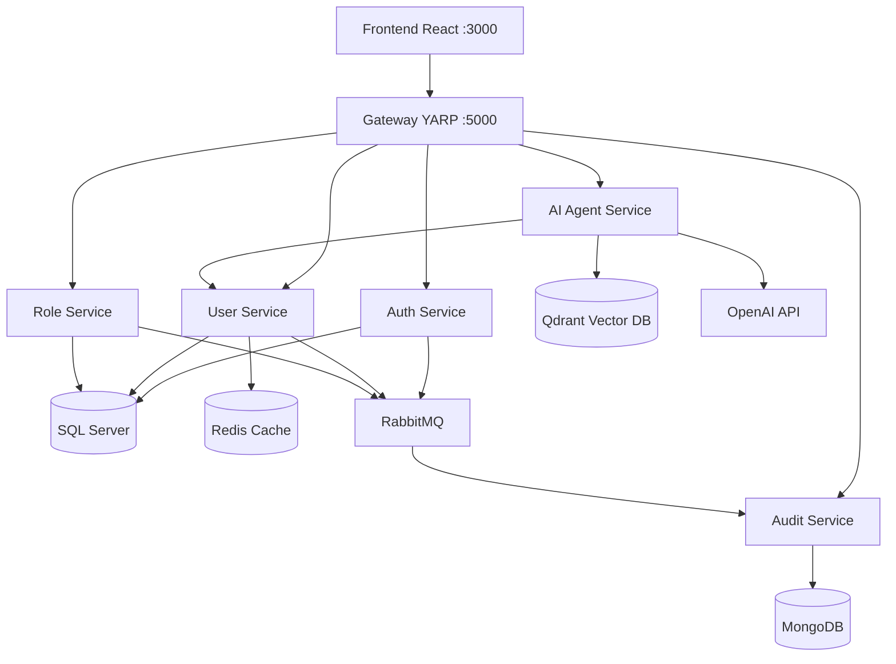

# Arquitectura del Sistema Toka

## Diagrama



## Microservicios

| Servicio | Responsabilidad | Base de datos |
|----------|-----------------|---------------|
| AuthService | Autenticación JWT, registro/login | SQL Server (TokaAuth) |
| UserService | CRUD usuarios, cache | SQL Server (TokaUsers) + Redis |
| RoleService | CRUD roles, asignación | SQL Server (TokaRoles) |
| AuditService | Registro de eventos | MongoDB |
| AiAgentService | Consultas RAG | Qdrant |

## Comunicación

- **Síncrona (REST):** Frontend → Gateway → microservicios
- **Asíncrona (RabbitMQ):** Eventos `user.created`, `user.updated`, `user.logged_in`, `role.assigned` → AuditService

## DDD y Clean Architecture

Cada microservicio sigue capas:

```
Api → Application → Domain ← Infrastructure
```

- **Domain:** Entidades, interfaces de repositorio (sin dependencias externas)
- **Application:** Casos de uso, DTOs, servicios de aplicación
- **Infrastructure:** EF Core, MongoDB, RabbitMQ, Redis, OpenAI/Qdrant
- **Api:** Controllers, Program.cs, configuración

## Decisiones técnicas

| Decisión | Justificación |
|----------|---------------|
| SQL Server | Datos transaccionales ACID para auth/users/roles |
| MongoDB | Esquema flexible para logs de auditoría append-only |
| Redis | Cache de listado de usuarios (TTL 5 min) |
| RabbitMQ | Desacoplamiento auth/users/roles → audit |
| Qdrant | Vector DB local en Docker para RAG |
| YARP Gateway | Punto único de entrada, simplifica CORS y routing |
| JWT simétrico | Validación distribuida sin servicio central de tokens |

## Flujo de datos – Crear usuario

1. Frontend POST `/api/users` → Gateway → UserService
2. UserService persiste en SQL Server, invalida cache Redis
3. Publica evento `user.created` en RabbitMQ
4. AuditService consume evento y guarda en MongoDB
5. Frontend puede consultar `/api/audit` para ver el registro
